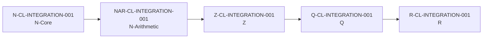
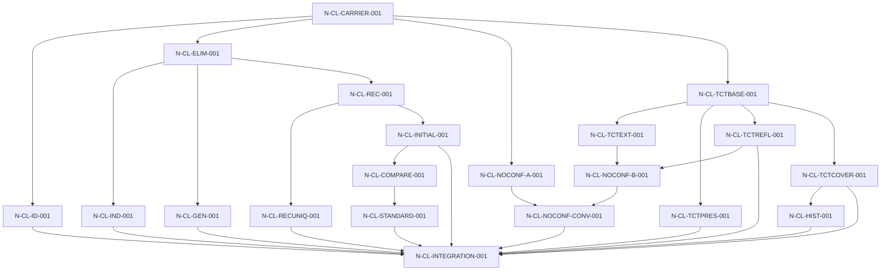
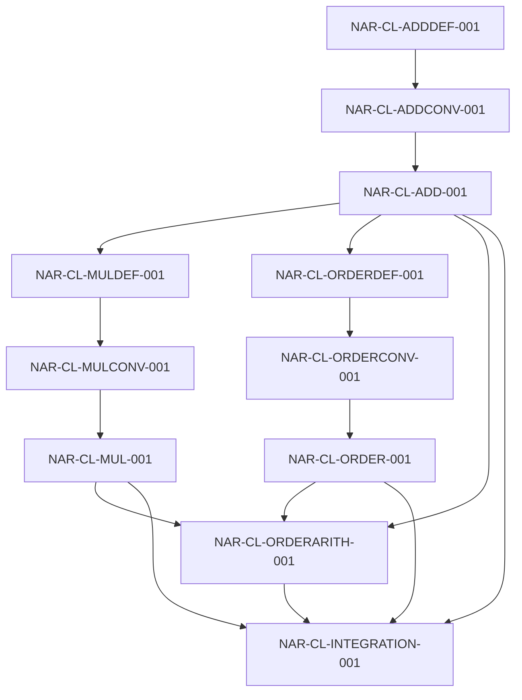
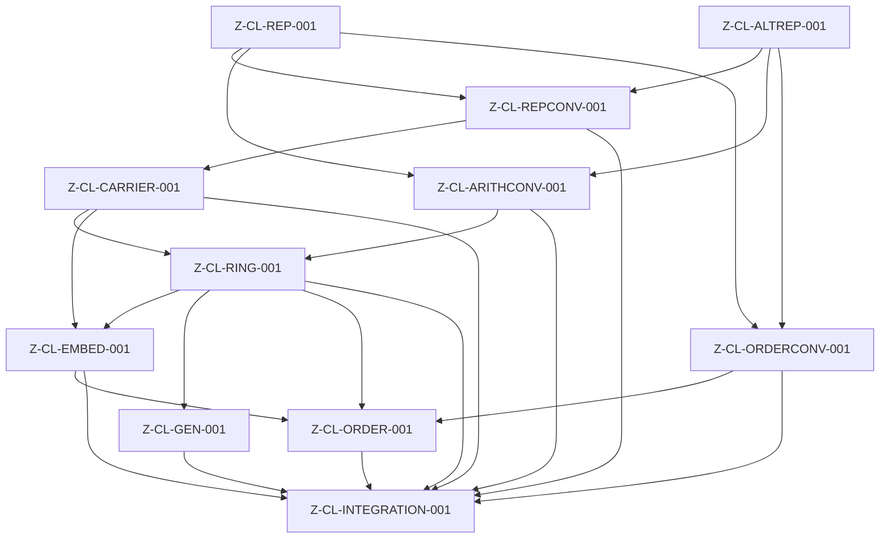
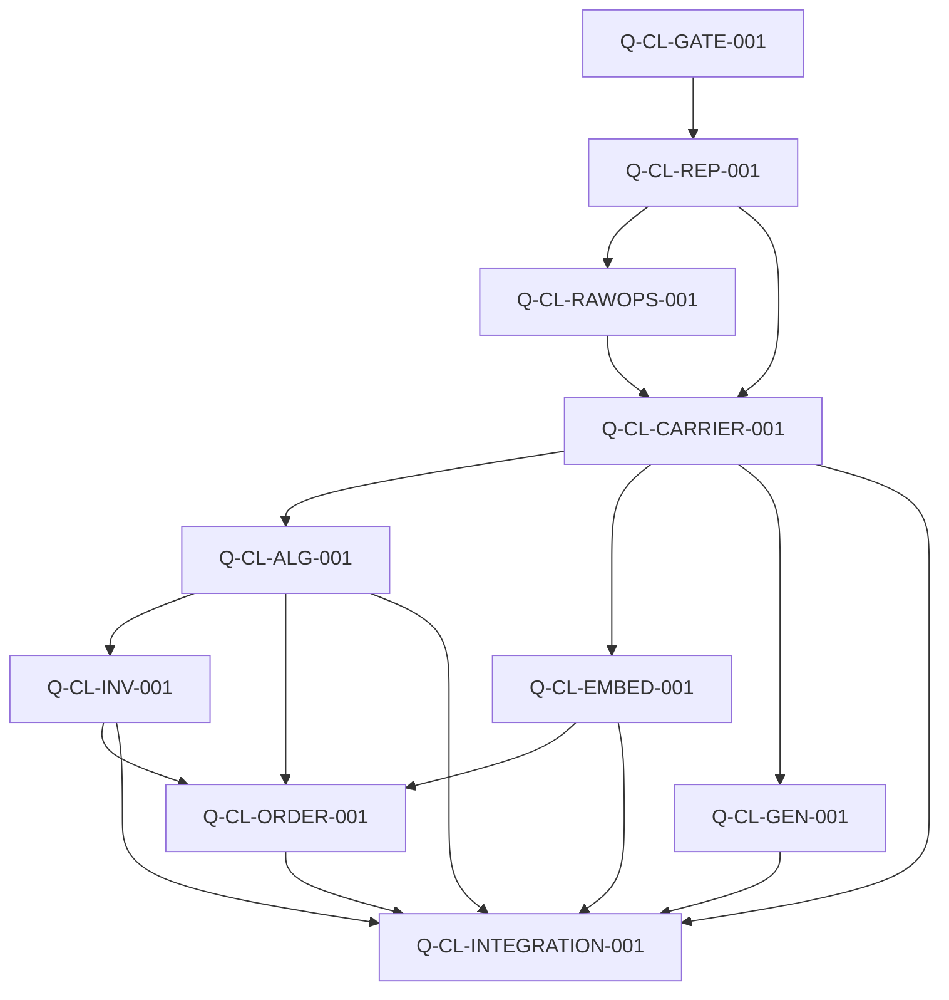
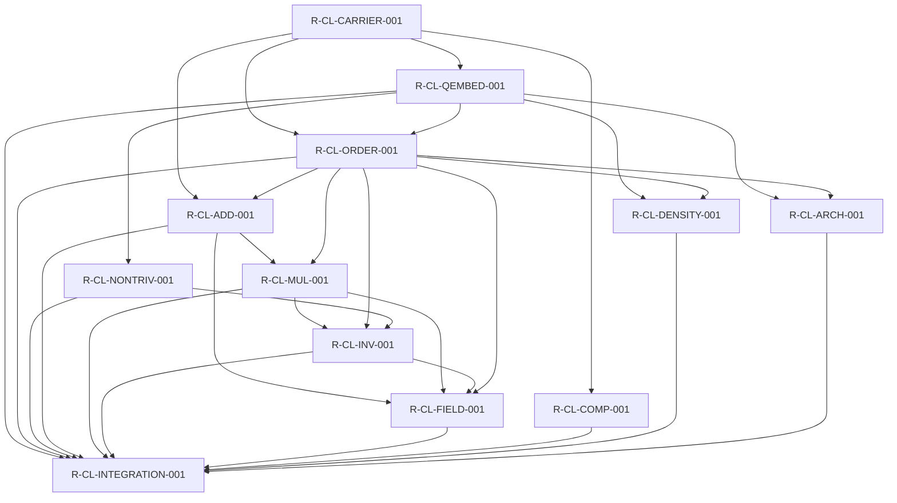

# CLAIM DEPENDENCY GRAPH VIEW — Accepted Assertion Architecture

**View ID:** `BOMA-VIEW-CLAIM-GRAPH-001`  
**Status:** GENERATED / DERIVED VIEW  
**Date:** 2026-08-21  
**Program:** `PDSA-ARCH-002`

## Authority boundary

This view summarizes **Claim-family dependencies and packaging**, not every Lean theorem edge. Exact theorem-level actual closures are the evidence JSON files produced by the stage transparency workflows.

```text
Claim-family arrow ≠ direct theorem dependency
Claim Record ≠ Construction Unit
Claim producer ≠ mathematical necessity of its selected route
```

Primary sources:

```text
LAB/00_ARCHITECTURE/CLAIM_REGISTRY.md
LAB/20_FORMALIZATION/*/*CLAIM_CLOSURE_AUDIT*.md
LAB/00_ARCHITECTURE/*_FORMAL_CLAIM_PRODUCER_POLICY.json
```

## Cross-stage integration spine



Every node above has an independent machine transparency certification on the architecture branch. The arrow means accepted downstream construction consumes the upstream accepted interface; it does not mean the upstream production history can be reconstructed from the downstream carrier.

## N-Core Claim-family graph



The TCT bridge Claims are scoped to selected backend representations and do not assert that a global completed carrier already existed in the pre-numerical object layer.

## N-Arithmetic Claim-family graph



The two definition Claims deliberately retain both recursive routes. Canonical `add := addR`, `mul := mulR`, and `LE := LEAdd` are post-reconvergence spellings, not necessity claims.

## Z Claim-family graph



`Z-CL-ALTREP-001` remains in the accepted Claim architecture even though signed forms were selected for the canonical carrier. Its role is not erased after `Z-DP-001`.

## Q Claim-family graph



The quotient carrier is a selected formalization choice. `Q-CL-CARRIER-001` therefore records an accepted carrier/identity property while the route remains explicitly classified as a formalization commitment.

## R Claim-family graph



R's actual theorem closure additionally exposes localized logical leaves (`Classical.em`, `Classical.byContradiction`) under explicit Claim/Decision references. They belong in the Logic/Trust view rather than being disguised as ordinary mathematical Claim nodes.

## Machine transparency summary

| Stage | Registered Claims | Producer-policy Claims | Residuals |
|---|---:|---:|---:|
| N-Core | 20 | 20 | 0 |
| N-Arithmetic | 11 | 11 | 0 |
| Z | 11 | 11 | 0 |
| Q | 10 | 10 | 0 |
| R | 12 | 12 | 0 |

The exact declaration-level dependency graph remains in the corresponding `*_FORMAL_DEPENDENCY_CLOSURE_PROTOTYPE_LATEST.json` evidence files.

## Current boundary

No `C-CL-*` Claim Record exists or is authorized.

```text
C NOT STARTED — USER HOLD
```
