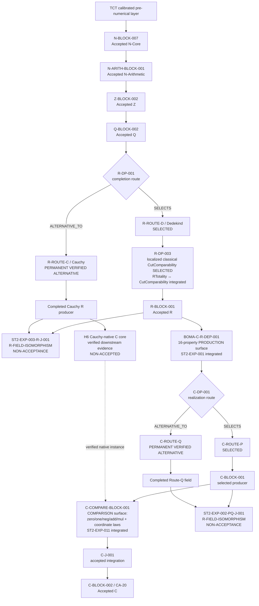

# CONSTRUCTION DAG VIEW — Accepted Spine + Permanent Verified Alternatives + Integrated Dependency and Logical-Regime Boundaries

**View ID:** `BOMA-VIEW-CONSTRUCTION-DAG-001`  
**Status:** GENERATED / DERIVED VIEW / SYNCHRONIZED  
**Date:** 2026-08-25  
**Program:** `PDSA-ARCH-002` + `BOMA-ST2-LEARNING-INTEGRATION-001` + `BOMA-ST2-LEARNING-INTEGRATION-002` + `BOMA-ST2-LEARNING-INTEGRATION-003`.

## Authority boundary

This is a derived view. It does not replace canonical `UNIT.md` records, Decision Points, Junction records, Claim ownership, or exact evidence.

```text
view arrow ≠ necessity theorem
SELECTS ≠ DERIVES
permanent alternative ≠ accepted export
reconvergence ≠ erased route history
integrated dependency knowledge ≠ accepted source refactor
formal dependency ≠ mathematical necessity
```

Primary sources:

```text
LAB/00_ARCHITECTURE/GRAPH.md
LAB/00_ARCHITECTURE/R_DAG.md
LAB/00_ARCHITECTURE/C_DAG.md
LAB/00_ARCHITECTURE/C_R_DEPENDENCY_CONTRACT.md
LAB/10_CONSTRUCTION/decisions/R-DP-003/UNIT.md
LAB/10_CONSTRUCTION/blocks/C-COMPARE-BLOCK-001/UNIT.md
LAB/00_ARCHITECTURE/DECISION_LEDGER.md
LAB/00_ARCHITECTURE/JUNCTION_LEDGER.md
LAB/PDSA/STAGE_TWO_SUCCESSFUL_EXPERIMENTS_ARCHITECTURE_INTEGRATION_001.md
LAB/PDSA/STAGE_TWO_SUCCESSFUL_EXPERIMENTS_ARCHITECTURE_INTEGRATION_002.md
LAB/PDSA/STAGE_TWO_SUCCESSFUL_EXPERIMENTS_ARCHITECTURE_INTEGRATION_003.md
```

## Current construction DAG



`RLOG` is the existing `R-DP-003` Decision Point, not a new unit created by the integration. Its selected provider remains localized classical comparability.

The dashed H6→comparison edge is verified robustness/instantiability evidence, not an accepted production edge and not a Junction.

## Interpretation of the R fork

```text
R-DP-001 SELECTS R-ROUTE-D / Dedekind
R-ROUTE-C / Cauchy is permanent and verified, but non-selected
ST2-EXP-003-R-J-001 proves field/order reconvergence
R-BLOCK-001 remains the accepted export
```

The alternative Junction is not the accepted R integration Junction `R-J-002`.

## Interpretation of the R-DP-003 logical-regime boundary

`ST2-EXP-004` integrated a sensitivity/invariant result around the **existing** Decision Point:

```text
selected Stage-I regime
  constructive rLE partial-order core
  + localized classical F-04 CutComparability witness
  + constructive totality bridge

same-carrier learned invariant
  RTotality ↔ CutComparability
```

No unconditional constructive `CutComparability` was recovered from the frozen `LowerCut` fields. F-05/F-06/F-07 remain independent localized logical commitments.

The current declaration impact of F-04 is measured as `8 DIRECT / 7 TRANSITIVE / 22 FREE / 18 OTHER_CLASSICAL_ONLY`; Gate B's `77/88` survivor count is a whole-source packaging measurement. Neither number is a mathematical-necessity theorem.

A located-cut redesign changes the representation and is only a possible separately authorized future candidate.

## Interpretation of the production R → C edge

`ST2-EXP-001` established that the mathematical **production** dependency of C on R is the exact sixteen-property surface recorded in `BOMA-C-R-DEP-001`.

`ST2-EXP-004` removed exactly `orderTotal` for a controlled sensitivity test. Seven C Claim families survived; the current field/integration proof closures did not. The non-survival is current proof-architecture evidence, not universal necessity.

The current accepted Lean implementation may still carry a larger bundled R package in formal ancestry. That over-bundling is formalization/provenance, not part of the canonical mathematical dependency contract.

## Interpretation of the comparison boundary

`ST2-EXP-011` established a distinct and narrower boundary inside `C-COMPARE-BLOCK-001`:

```text
scalar operations
  zero / one / neg / add / mul

quadratic coordinate laws
  coord
  coordinateGeneration / coordinateUnique
  coordinateZero / coordinateOne / coordinateReal / coordinateImag
  coordinateNeg / coordinateAdd / coordinateMul
```

Accepted RBOMA `Related` semantics are preserved definitionally. A native RCBOMA/H6 instance is verified without H5/Dedekind implementation transport.

`C-CL-COMPARE-001` also survives the ST2-EXP-004 Gate-E alternative without production `orderTotal`, consistent with this separate comparison boundary.

The experimental generic source remains research-only; the accepted comparison implementation has not been silently replaced.

## Relation/function firewall

```text
relation-level comparison
  total + single-valued

!=

selected comparison function
```

Actual functions require explicit `CoordinateExtractor` data. No global coordinate or inverse selector is part of the integrated comparison contract.

## Interpretation of the C fork

```text
C-DP-001 SELECTS C-ROUTE-P
C-ROUTE-Q is permanent and verified, but non-selected
ST2-EXP-002-PQ-J-001 proves P/Q field isomorphism
C-J-001 remains the accepted integration Junction
C-BLOCK-002 / CA-20 remains the accepted export
```

## Learning/provenance overlay

```text
ST2-EXP-001  CLOSED / PASS
  learned → exact 16-property production R→C dependency surface

ST2-EXP-002  CLOSED / PASS
  learned → C-ROUTE-Q complete verified alternative + ST2-EXP-002-PQ-J-001

ST2-EXP-003  CLOSED / PASS
  learned → R-ROUTE-C complete verified alternative + ST2-EXP-003-R-J-001 + H6

ST2-EXP-011  CLOSED / PASS
  learned → scalar-generic quadratic comparison boundary + relation/function firewall

ST2-EXP-004  CLOSED / PASS
  learned → exact F-04 current proof/package impact
            + same-carrier RTotality ↔ CutComparability
            + no unconditional constructive totality recovery
            + orderTotal downstream C sensitivity
            + F-05/F-06/F-07 remain independent controls
```

The Learning Graph retains chronology, Frozen Plans, failed runs, exact artifacts, Study/Act, lifecycle, research merges, and integration decisions.

## Current boundary

```text
accepted spine             TCT → N-Core → N-Arithmetic → Z → Q → R-BLOCK-001 → C-BLOCK-002
R selected route           Dedekind
R logical regime           localized classical comparability / retained
R totality boundary        RTotality ↔ CutComparability / integrated
R permanent alternative    Cauchy
C production R→C contract  exact sixteen-property interface
C selected route           C-ROUTE-P
C comparison contract      zero/one/neg/add/mul + coordinate laws
C permanent alternative    C-ROUTE-Q
active experiment          NONE
next experiment            NOT AUTHORIZED
required next act          STOP / OWNER AUTHORIZATION REQUIRED
```
