# CONSTRUCTION DAG VIEW — Current Accepted Construction Architecture + Active C Frontier

**View ID:** `BOMA-VIEW-CONSTRUCTION-DAG-001`  
**Status:** GENERATED / DERIVED VIEW  
**Date:** 2026-08-21  
**Program:** `PDSA-ARCH-002` + C continuation under `PDSA-C-001/002`

## Authority boundary

This file is a **derived view**. It does not replace canonical `UNIT.md` records, Decision Points, Junction records, Block membership, or acceptance evidence.

```text
view arrow ≠ necessity theorem
reconvergence ≠ erased route history
selected route ≠ rejected alternative
candidate route ≠ canonical Block
formal probe ≠ accepted C construction
```

Primary sources:

```text
LAB/00_ARCHITECTURE/BLOCK_CLAIM_MAP.md
LAB/00_ARCHITECTURE/JUNCTION_LEDGER.md
LAB/00_ARCHITECTURE/DECISION_LEDGER.md
LAB/00_ARCHITECTURE/CLAIM_REGISTRY.md
LAB/00_ARCHITECTURE/C_DAG.md
LAB/00_ARCHITECTURE/C_R_DEPENDENCY_CONTRACT.md
```

## Current accepted construction DAG plus active frontier

```mermaid
flowchart TD
  subgraph TCT[Pre-numerical TCT — calibrated constructional layer]
    T1[TCT-BLOCK-001\nconstruction kernel]
    T2[TCT-BLOCK-002\nselected presentations]
    T3[TCT-BLOCK-003\ncanonical decomposition]
    T4[TCT-BLOCK-004\nstructural history]
    T5[TCT-BLOCK-005\nterminal extension]
    TJ[TCT-J-001\ncanonicality gate]
    T1 --> T2 --> T3
    T3 --> T4
    T3 --> T5
    T3 --> TJ
  end

  subgraph NC[N-Core — NAC-15 ACCEPT]
    NDP1{N-DP-001\nR-B selected}
    NDP2{N-DP-002\neliminator/scope}
    NB1[N-BLOCK-001\nformal unary kernel]
    NBA[N-BLOCK-002\nno-confusion Route A]
    NBI[N-BLOCK-003\ninduction / generatedness]
    NBR[N-BLOCK-004\nrecursion / initiality]
    NBT[N-BLOCK-005\nTCT realization bridge]
    NRB[N-BR-018\nconstructional Route B]
    NJ1[N-J-001\nno-confusion reconvergence]
    NBS[N-BLOCK-006\nstandardness]
    NJ2[N-J-002\nintegration]
    NB7[N-BLOCK-007\naccepted N-Core export]

    NDP1 --> NB1
    NDP2 --> NB1
    NB1 --> NBA
    NB1 --> NBI
    NB1 --> NBR
    TJ --> NBT
    NB1 --> NBT
    NBT --> NRB
    NBA --> NJ1
    NRB --> NJ1
    NBR --> NBS
    NB1 --> NJ2
    NBI --> NJ2
    NBR --> NJ2
    NBT --> NJ2
    NJ1 --> NJ2
    NBS --> NJ2
    NJ2 --> NB7
  end

  subgraph NA[N-Arithmetic — NAA-18 ACCEPT]
    AR[N-ADD-BLOCK-001\naddR]
    AL[N-ADD-BLOCK-002\naddL]
    AJ[N-ADD-J-001\nequality]
    AC[N-ADD-BLOCK-003\ncanonical add]

    MR[N-MUL-BLOCK-001\nmulR]
    ML[N-MUL-BLOCK-002\nmulL]
    MJ[N-MUL-J-001\nequality]
    MC[N-MUL-BLOCK-003\ncanonical mul]

    OA[N-ORD-BLOCK-001\nadditive-gap order]
    OI[N-ORD-BLOCK-002\ninductive order]
    OJ[N-ORD-J-001\nequivalence]
    OC[N-ORD-BLOCK-003\ncanonical order]
    OAC[N-ORD-BLOCK-004\norder/arithmetic compatibility]
    NAJ[N-ARITH-J-001\nintegration]
    NAB[N-ARITH-BLOCK-001\naccepted N-Arithmetic]

    NB7 --> AR
    NB7 --> AL
    AR --> AJ
    AL --> AJ
    AJ --> AC

    AC --> MR
    AC --> ML
    MR --> MJ
    ML --> MJ
    MJ --> MC

    AC --> OA
    NB7 --> OI
    OA --> OJ
    OI --> OJ
    OJ --> OC
    AC --> OAC
    MC --> OAC
    OC --> OAC

    AC --> NAJ
    MC --> NAJ
    OC --> NAJ
    OAC --> NAJ
    NAJ --> NAB
  end

  subgraph ZS[Z — ZA-21 ACCEPT]
    ZS1[Z-S-BLOCK-001\nsigned normal forms]
    ZD1[Z-D-BLOCK-001\ndifference pairs + ~]
    ZJ1[Z-J-001\nequivalence + classification]
    ZDP{Z-DP-001\nsigned selected}
    ZB1[Z-BLOCK-001\nselected carrier]

    ZAD[Z-ARITH-BLOCK-001\ndirect signed arithmetic]
    ZAP[Z-ARITH-BLOCK-002\npair-mediated arithmetic]
    ZAJ[Z-ARITH-J-001\npointwise equality]
    ZAC[Z-ARITH-BLOCK-003\ncanonical ring]

    ZOD[direct signed order]
    ZOP[pair cross-sum order]
    ZOJ[Z-ORD-J-001\nequivalence]
    ZOC[Z-ORD-BLOCK-001\nordered ring]
    ZJ2[Z-J-002\nintegration]
    ZB2[Z-BLOCK-002\naccepted Z]

    NAB --> ZS1
    NAB --> ZD1
    ZS1 --> ZJ1
    ZD1 --> ZJ1
    ZJ1 --> ZDP --> ZB1

    ZB1 --> ZAD
    ZD1 --> ZAP
    ZAD --> ZAJ
    ZAP --> ZAJ
    ZAJ --> ZAC

    ZB1 --> ZOD
    ZD1 --> ZOP
    ZOD --> ZOJ
    ZOP --> ZOJ
    ZOJ --> ZOC
    ZAC --> ZOC

    ZB1 --> ZJ2
    ZAC --> ZJ2
    ZOC --> ZJ2
    ZJ2 --> ZB2
  end

  subgraph Q[Q — QA-23 ACCEPT]
    QG[Q-GATE-BLOCK-001\nnonzero cancellation gateway]
    QF1[Q-F-BLOCK-001\nRawFrac + FracEquiv]
    QF2[Q-F-BLOCK-002\nraw operations + respect]
    QDP{Q-DP-001\nQuotient fracSetoid selected}
    QB1[Q-BLOCK-001\nQBOMA carrier + lifted ops]
    QPKG[field / order / embedding / generation]
    QJ2[Q-J-002\nintegration]
    QB2[Q-BLOCK-002\naccepted Q]

    ZB2 --> QG --> QF1 --> QF2 --> QDP --> QB1
    QB1 --> QPKG --> QJ2 --> QB2
  end

  subgraph R[R — RA-22 ACCEPT]
    RDP1{R-DP-001\nDedekind selected\nCauchy retained}
    RID[LowerCut / CutEquiv]
    RDP2{R-DP-002\nQuotient cutSetoid}
    RCAR[RBOMA]
    RORD[order core]
    RDP3{R-DP-003\nlocalized comparability}
    RLOG[R-LOGIC-BR-001\nclassical witness]
    RADD[R-ADD-GROUP-BLOCK-001]
    RDP5{R-DP-005\npos/neg multiplication}
    RMUL[R-MUL-BLOCK-001]
    RDP6{R-DP-006\ndirect reciprocal}
    RINV[R-FIELD-BLOCK-001]
    RCOMP[R-COMP-BLOCK-001\nDedekind LUB]
    RDEN[R-DENSITY-BLOCK-001]
    RARCH[R-ARCH-BLOCK-001]
    RJ2[R-J-002\nintegration]
    RB1[R-BLOCK-001\naccepted R]

    QB2 --> RDP1 --> RID --> RDP2 --> RCAR
    RCAR --> RORD
    RDP3 --> RLOG --> RORD
    RCAR --> RADD
    RADD --> RDP5 --> RMUL
    RMUL --> RDP6 --> RINV
    RCAR --> RCOMP
    QB2 --> RDEN
    RCAR --> RDEN
    QB2 --> RARCH
    RCAR --> RARCH
    RORD --> RJ2
    RADD --> RJ2
    RMUL --> RJ2
    RINV --> RJ2
    RCOMP --> RJ2
    RDEN --> RJ2
    RARCH --> RJ2
    RJ2 --> RB1
  end

  RB1 --> RRE[RE-R-001\nCLOSED / dependency classification]

  subgraph C[C — STARTED / NOT ACCEPTED]
    CA[BOMA-C-ACCEPT-001\nrepresentation-neutral acceptance]
    CRD[BOMA-C-R-DEP-001\naccepted-R dependency boundary]
    CP1[PDSA-C-001\nH1/H2 rejected; H3 adopted; H4 deferred]
    CP2[PDSA-C-002\nabstract R-interface probe\nformal payload staged / V5 pending]
    CDP{C-DP-001\nOPEN — SELECTS NONE}
    RP[C-ROUTE-P\nrank-two / ordered-pair candidate]
    RQ[C-ROUTE-Q\npolynomial-adjunction / quotient candidate]
    RA[C-ROUTE-A\nconditional independent candidate]

    RRE --> CA --> CRD --> CP1
    CRD --> CP2
    CP1 --> CDP
    CP2 -. shared boundary evidence .-> CDP
    CDP --> RP
    CDP --> RQ
    CDP --> RA
  end
```



## Retained alternatives that must remain visible

| Decision | Selected | Retained alternative(s) |
|---|---|---|
| `N-DP-001` | fresh R-B inductive unary carrier | set/Peano-style, categorical NNO, free-monoid-derived regimes |
| `N-DP-002` | explicit accepted eliminator/universe scope | stronger heterogeneous cross-universe formulations remain later possibilities |
| `Z-DP-001` | signed normal forms | difference pairs + explicit equivalence retained as an active provenance route |
| `Q-DP-001` | `Quotient fracSetoid` | reduced fractions; raw syntax + external `FracEquiv` |
| `R-DP-001` | Dedekind lower cuts | Cauchy completion retained |
| `R-DP-002` | `Quotient cutSetoid` | raw LowerCut + external `CutEquiv` |
| `R-DP-003` | localized classical comparability | constructive locatedness / strengthened-cut regimes |
| `R-DP-004` | reusable Q approximation gateway | direct one-off cut bracketing |
| `R-DP-005` | positive/negative decomposition multiplication | direct sign-case or shift-to-positive architectures |
| `R-DP-006` | direct positive reciprocal | completeness/supremum inverse route |
| `C-DP-001` | **NONE — OPEN** | ordered-pair/rank-two; polynomial-adjunction/quotient; third route only if genuinely independent |

## C frontier interpretation

The accepted-export chain still ends at R:

```text
pre-numerical → N-Core → N-Arithmetic → Z → Q → R
```

C is an **active research frontier**, not an accepted extension of that spine yet.

Current distinctions:

```text
C acceptance specification   ACTIVE
C provisional Claims         OPEN
C R-boundary formal probe    PRESENT
C V5 boundary result         NOT YET CERTIFIED
C representation             UNSELECTED
C canonical Block            NONE
C Junction                   NONE
C accepted export            NONE
```

All five accepted number-stage exports through R retain branch-local machine transparency certification under `PDSA-ARCH-002`. C must earn its own evidence as Claims are constructed; earlier stage PASS records do not transfer automatically.