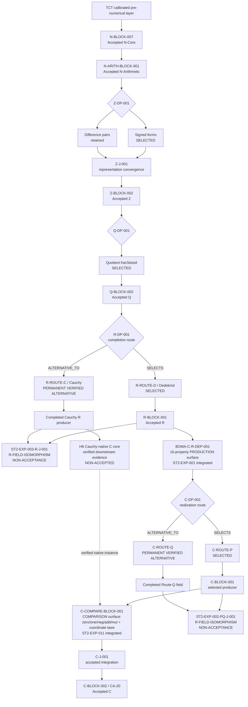

# CONSTRUCTION DAG VIEW — Accepted Spine + Permanent Verified Alternatives + Generic Comparison Boundary

**View ID:** `BOMA-VIEW-CONSTRUCTION-DAG-001`  
**Status:** GENERATED / DERIVED VIEW / SYNCHRONIZED  
**Date:** 2026-08-24  
**Program:** `PDSA-ARCH-002` + `BOMA-ST2-LEARNING-INTEGRATION-001` + `BOMA-ST2-LEARNING-INTEGRATION-002`.

## Authority boundary

This is a derived view. It does not replace canonical `UNIT.md` records,
Decision Points, Junction records, Claim ownership, or exact evidence.

```text
view arrow ≠ necessity theorem
SELECTS ≠ DERIVES
permanent alternative ≠ accepted export
reconvergence ≠ erased route history
integrated dependency knowledge ≠ accepted source refactor
```

Primary sources:

```text
LAB/00_ARCHITECTURE/GRAPH.md
LAB/00_ARCHITECTURE/R_DAG.md
LAB/00_ARCHITECTURE/C_DAG.md
LAB/00_ARCHITECTURE/C_R_DEPENDENCY_CONTRACT.md
LAB/10_CONSTRUCTION/blocks/C-COMPARE-BLOCK-001/UNIT.md
LAB/00_ARCHITECTURE/DECISION_LEDGER.md
LAB/00_ARCHITECTURE/JUNCTION_LEDGER.md
LAB/PDSA/STAGE_TWO_SUCCESSFUL_EXPERIMENTS_ARCHITECTURE_INTEGRATION_001.md
LAB/PDSA/STAGE_TWO_SUCCESSFUL_EXPERIMENTS_ARCHITECTURE_INTEGRATION_002.md
```

## Current construction DAG



The dashed H6→comparison edge is verified robustness/instantiability evidence,
not an accepted production edge and not a Junction.

## Interpretation of the R fork

```text
R-DP-001 SELECTS R-ROUTE-D / Dedekind
R-ROUTE-C / Cauchy is permanent and verified, but non-selected
ST2-EXP-003-R-J-001 proves field/order reconvergence
R-BLOCK-001 remains the accepted export
```

The alternative Junction is not the accepted R integration Junction `R-J-002`.

## Interpretation of the production R → C edge

`ST2-EXP-001` established that the mathematical **production** dependency of C
on R is the exact sixteen-property surface recorded in `BOMA-C-R-DEP-001`.

The current accepted Lean implementation may still carry a larger bundled R
package in formal ancestry. That over-bundling is formalization/provenance, not
part of the canonical mathematical dependency contract.

## Interpretation of the comparison boundary

`ST2-EXP-011` established a distinct and narrower boundary inside
`C-COMPARE-BLOCK-001`:

```text
scalar operations
  zero / one / neg / add / mul

quadratic coordinate laws
  coord
  coordinateGeneration / coordinateUnique
  coordinateZero / coordinateOne / coordinateReal / coordinateImag
  coordinateNeg / coordinateAdd / coordinateMul
```

This is the direct mathematical closure of `C-CL-COMPARE-001` under the verified
generic factoring. It must not be substituted for the sixteen-property
production contract.

Accepted RBOMA `Related` semantics are preserved definitionally. A native
RCBOMA/H6 instance is verified without H5/Dedekind implementation transport.

The experimental generic source remains research-only; the accepted comparison
implementation has not been silently replaced.

## Relation/function firewall

```text
relation-level comparison
  total + single-valued

!=

selected comparison function
```

Actual functions require explicit `CoordinateExtractor` data. No global
coordinate or inverse selector is part of the integrated comparison contract.

## Interpretation of the C fork

```text
C-DP-001 SELECTS C-ROUTE-P
C-ROUTE-Q is permanent and verified, but non-selected
ST2-EXP-002-PQ-J-001 proves P/Q field isomorphism
C-J-001 remains the accepted integration Junction
C-BLOCK-002 / CA-20 remains the accepted export
```

## H6 downstream evidence

The Cauchy R producer supports an independent H6 rebuild of seven selected
`C-BLOCK-001` core meanings. `ST2-EXP-011` additionally verifies that the H6
research producer can instantiate the generic comparison interface directly.

H6 is shown because it is permanent downstream robustness evidence, not because
it is an accepted C producer.

## Learning/provenance overlay

```text
ST2-EXP-001  CLOSED / PASS
  learned → exact 16-property production R→C dependency surface

ST2-EXP-002  CLOSED / PASS
  learned → C-ROUTE-Q complete verified alternative
            + ST2-EXP-002-PQ-J-001

ST2-EXP-003  CLOSED / PASS
  learned → R-ROUTE-C complete verified alternative
            + ST2-EXP-003-R-J-001
            + H6 downstream robustness

ST2-EXP-011  CLOSED / PASS
  learned → scalar-generic quadratic comparison boundary
            + accepted semantics preservation
            + native H6 instantiability without H5 transport
            + relation/function firewall
```

The Learning Graph retains chronology, Frozen Plans, failed runs, exact
artifacts, Study/Act, lifecycle, merge, and integration decisions.

## Current boundary

```text
accepted spine             TCT → N-Core → N-Arithmetic → Z → Q → R-BLOCK-001 → C-BLOCK-002
R selected route           Dedekind
R permanent alternative    Cauchy
C production R→C contract  exact sixteen-property interface
C selected route           C-ROUTE-P
C comparison contract      zero/one/neg/add/mul + coordinate laws
C permanent alternative    C-ROUTE-Q
active experiment          NONE
next owner-sequenced       ST2-EXP-004 / NOT ACTIVE / NO FROZEN PLAN
```
