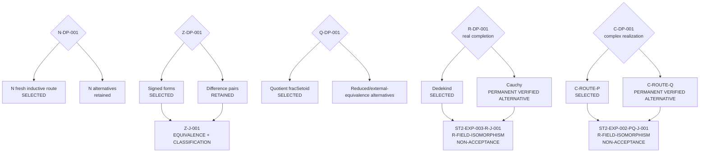

# DECISION / BRANCH / JUNCTION VIEW — Selection Without Provenance Loss

**View ID:** `BOMA-VIEW-DECISION-BRANCH-JUNCTION-001`  
**Status:** GENERATED / DERIVED VIEW / SYNCHRONIZED  
**Date:** 2026-08-24  
**Program:** `PDSA-ARCH-002` + `BOMA-ST2-LEARNING-INTEGRATION-001`.

## Governing rule

```text
SELECTED ≠ DERIVED NECESSITY
RECONVERGED ≠ HISTORICALLY IDENTICAL
PERMANENT ALTERNATIVE ≠ ACCEPTED EXPORT
SUCCESSFUL EXPERIMENT ≠ JUNCTION BY DEFAULT
```

This view combines the current Decision and Junction ledgers. Exact rationale,
sensitivity, and acceptance consequences remain authoritative in their source records.

## Number-stage branch topology



The R/C alternative Junctions certify convergence facts but do not change the
`SELECTS` edges.

## Current decision semantics

### `R-DP-001`

```text
SELECTS      R-ROUTE-D / Dedekind
PERMANENT    R-ROUTE-C / Cauchy
MEETS_AT     ST2-EXP-003-R-J-001
ACCEPTED     R-BLOCK-001 remains Dedekind-produced
```

### `C-DP-001`

```text
SELECTS      C-ROUTE-P
PERMANENT    C-ROUTE-Q
MEETS_AT     ST2-EXP-002-PQ-J-001
ACCEPTED     C-BLOCK-002 / CA-20 remains Route-P-based
```

## Dependency-edge learning that is not a Decision or Junction

`ST2-EXP-001` attaches to:

```text
R-BLOCK-001 -- BOMA-C-R-DEP-001 --> C construction
```

Its result is:

```text
whole accepted R bundle
   ↓ refined to
exact sixteen-property mathematical dependency surface
```

This is a `REFINES`/dependency-contract result, not a new branch-selection
Decision and not a Junction.

## Junction strength index

| Junction | Strength | Acceptance role |
|---|---|---|
| `TCT-J-001` | `CANONICALITY GATE` | canonical construction gate |
| `N-J-001` | `SAME-DOWNSTREAM-ADEQUACY` | accepted N contribution |
| `N-J-002` | `SAME-CARRIER-INTEGRATION` | accepted N integration |
| `N-ADD-J-001` | `EQUALITY` | accepted arithmetic route convergence |
| `N-MUL-J-001` | `EQUALITY` | accepted arithmetic route convergence |
| `N-ORD-J-001` | `EQUIVALENCE` | accepted order convergence |
| `N-ARITH-J-001` | `SAME-CARRIER-INTEGRATION` | accepted N-Arithmetic integration |
| `Z-J-001` | `EQUIVALENCE + CLASSIFICATION` | representation convergence before selection |
| `Z-ARITH-J-001` | `EQUALITY` | accepted arithmetic convergence |
| `Z-ORD-J-001` | `EQUIVALENCE` | accepted order convergence |
| `Z-J-002` | `SAME-CARRIER-INTEGRATION` | accepted Z integration |
| `Z-RE-J-001` | `INTERFACE-RECONVERGENCE / PROVENANCE-DIVERGENCE` | reverse-learning Junction |
| `Q-J-002` | `SAME-CARRIER-INTEGRATION` | accepted Q integration |
| `R-J-002` | `SAME-CARRIER-INTEGRATION` | accepted R integration |
| `C-J-001` | `SAME-CARRIER-INTEGRATION` | accepted C integration |
| `ST2-EXP-002-PQ-J-001` | `R-FIELD-ISOMORPHISM` | permanent alternative-construction / NON-ACCEPTANCE |
| `ST2-EXP-003-R-J-001` | `R-FIELD-ISOMORPHISM` | permanent alternative-construction / NON-ACCEPTANCE |

## Provenance invariants

Every reconverged route keeps visible:

```text
route identity
route-local assumptions
route-local evidence
strength of reconvergence
selection status
acceptance role
```

A permanent alternative remains a real member of the Construction DAG even
when the selected downstream spelling uses another producer.

## Current boundary

```text
R-DP-001       RESOLVED / DEDekind SELECTED / CAUCHY VERIFIED ALTERNATIVE
C-DP-001       RESOLVED / C-ROUTE-P SELECTED / C-ROUTE-Q VERIFIED ALTERNATIVE
R alternative Junction   ST2-EXP-003-R-J-001
C alternative Junction   ST2-EXP-002-PQ-J-001
R→C dependency lesson    ST2-EXP-001 integrated into BOMA-C-R-DEP-001
active experiment        NONE
```
