# DECISION / BRANCH / JUNCTION VIEW — Selection Without Provenance Loss

**View ID:** `BOMA-VIEW-DECISION-BRANCH-JUNCTION-001`  
**Status:** GENERATED / DERIVED VIEW  
**Date:** 2026-08-21  
**Program:** `PDSA-ARCH-002` + C continuation under `PDSA-C-001/002`

## Governing rule

```text
SELECTED ≠ DERIVED NECESSITY
RECONVERGED ≠ HISTORICALLY IDENTICAL
OPEN ≠ PARTIALLY SELECTED
CANDIDATE ROUTE ≠ CANONICAL BLOCK
```

This view combines the current Decision and Junction ledgers. Exact rationale, sensitivity, and acceptance consequences remain authoritative in canonical Decision/Junction records.

## Number-stage branch topology

```mermaid
flowchart TD
  subgraph NCORE[N-Core]
    NDP1{N-DP-001\nformal realization regime}
    NRA[R-A\nset / Peano-style]
    NRB[R-B\nfresh inductive unary carrier\nSELECTED]
    NRC[R-C\ncategorical NNO]
    NRD[R-D\nfree-monoid-derived]
    NDP2{N-DP-002\neliminator / universe scope}
    NSCOPE[Sort-polymorphic eliminator\nType-polymorphic fold\nsame-universe initiality\nSELECTED]
    NALT[stronger heterogeneous scope\nRETAINED]
    RA[internal no-confusion Route A]
    RB[constructional no-confusion Route B]
    NJ1[N-J-001\nSAME-DOWNSTREAM-ADEQUACY]
    NJ2[N-J-002\nSAME-CARRIER-INTEGRATION]

    NDP1 --> NRA
    NDP1 --> NRB
    NDP1 --> NRC
    NDP1 --> NRD
    NRB --> NDP2
    NDP2 --> NSCOPE
    NDP2 --> NALT
    NSCOPE --> RA
    NSCOPE --> RB
    RA --> NJ1
    RB --> NJ1
    NJ1 --> NJ2
  end

  subgraph NAR[N-Arithmetic]
    ADDR[addR\nright recursion]
    ADDL[addL\nleft recursion]
    ADDJ[N-ADD-J-001\nEQUALITY]
    MULR[mulR\nright recursion]
    MULL[mulL\nleft recursion]
    MULJ[N-MUL-J-001\nEQUALITY]
    ORDA[LEAdd\nadditive witness]
    ORDI[LEInd\nindependent inductive]
    ORDJ[N-ORD-J-001\nEQUIVALENCE]
    NAI[N-ARITH-J-001\nSAME-CARRIER-INTEGRATION]

    ADDR --> ADDJ
    ADDL --> ADDJ
    ADDJ --> MULR
    ADDJ --> MULL
    MULR --> MULJ
    MULL --> MULJ
    ADDJ --> ORDA
    ORDI --> ORDJ
    ORDA --> ORDJ
    ADDJ --> NAI
    MULJ --> NAI
    ORDJ --> NAI
  end

  subgraph Z[Z]
    ZS[signed normal forms]
    ZD[difference pairs + ~]
    ZJ1[Z-J-001\nEQUIVALENCE + CLASSIFICATION]
    ZDP{Z-DP-001\ncanonical representation}
    ZSEL[signed forms\nSELECTED]
    ZRET[difference pairs\nRETAINED]
    ZAD[direct signed arithmetic]
    ZAP[pair-mediated arithmetic]
    ZAJ[Z-ARITH-J-001\nEQUALITY]
    ZOD[direct signed order]
    ZOP[pair cross-sum order]
    ZOJ[Z-ORD-J-001\nEQUIVALENCE]
    ZJ2[Z-J-002\nSAME-CARRIER-INTEGRATION]

    ZS --> ZJ1
    ZD --> ZJ1
    ZJ1 --> ZDP
    ZDP --> ZSEL
    ZDP --> ZRET
    ZSEL --> ZAD
    ZRET --> ZAP
    ZAD --> ZAJ
    ZAP --> ZAJ
    ZSEL --> ZOD
    ZRET --> ZOP
    ZOD --> ZOJ
    ZOP --> ZOJ
    ZAJ --> ZJ2
    ZOJ --> ZJ2
  end

  subgraph Q[Q]
    QDP{Q-DP-001\nformal rational identity}
    QQ[Quotient fracSetoid\nSELECTED]
    QR[reduced fractions\nRETAINED]
    QE[raw syntax + external FracEquiv\nRETAINED]
    QJ[Q-J-002\nSAME-CARRIER-INTEGRATION]
    QDP --> QQ --> QJ
    QDP --> QR
    QDP --> QE
  end

  subgraph R[R]
    RDP1{R-DP-001\ncompletion route}
    DED[Dedekind lower cuts\nSELECTED]
    CAU[Cauchy completion\nRETAINED]
    RDP2{R-DP-002\nformal identity}
    RQ[Quotient cutSetoid\nSELECTED]
    REQ[external CutEquiv\nRETAINED]
    RDP3{R-DP-003\ntotal-order logical regime}
    RCL[localized classical comparability\nSELECTED]
    RLOC[constructive locatedness / stronger cuts\nRETAINED]
    RDP4{R-DP-004\napproximation route}
    RAP[reusable Q approximation gateway\nSELECTED]
    RBR[direct one-off bracketing\nRETAINED]
    RDP5{R-DP-005\nmultiplication architecture}
    RPM[pos/neg decomposition\nSELECTED]
    RSM[direct sign-case\nRETAINED]
    RSH[shift-to-positive\nRETAINED]
    RDP6{R-DP-006\ninverse architecture}
    RRI[direct positive reciprocal\nSELECTED]
    RSI[supremum / completeness inverse\nRETAINED]
    RJ[R-J-002\nSAME-CARRIER-INTEGRATION]

    RDP1 --> DED
    RDP1 --> CAU
    DED --> RDP2
    RDP2 --> RQ
    RDP2 --> REQ
    RQ --> RDP3
    RDP3 --> RCL
    RDP3 --> RLOC
    RQ --> RDP4
    RDP4 --> RAP
    RDP4 --> RBR
    RQ --> RDP5
    RDP5 --> RPM
    RDP5 --> RSM
    RDP5 --> RSH
    RPM --> RDP6
    RDP6 --> RRI
    RDP6 --> RSI
    RCL --> RJ
    RAP --> RJ
    RPM --> RJ
    RRI --> RJ
  end

  subgraph C[C — active unaccepted frontier]
    CAC[BOMA-C-ACCEPT-001\ncommon semantic contract]
    CBD[PDSA-C-002\nshared R-boundary probe]
    CDP{C-DP-001\nOPEN — SELECTS NONE}
    CP[C-ROUTE-P\nrank-two / ordered-pair\nCANDIDATE]
    CQ[C-ROUTE-Q\npolynomial-adjunction / quotient\nCANDIDATE]
    CA[C-ROUTE-A\nconditional genuinely independent\nCANDIDATE SLOT]
    FUTURE[future comparison Junction\nONLY IF multiple actual producers exist]

    CAC --> CDP
    CBD -. common evidence .-> CDP
    CDP --> CP
    CDP --> CQ
    CDP --> CA
    CP -. no Junction yet .-> FUTURE
    CQ -. no Junction yet .-> FUTURE
  end

  NJ2 --> ADDR
  NJ2 --> ADDL
  NAI --> ZS
  NAI --> ZD
  ZJ2 --> QDP
  QJ --> RDP1
  RJ --> CAC
```



The dotted C arrows toward the future comparison node are **expectation markers only**. They do not assert that either route has been built or that a Junction currently exists.

## Junction strength index

| Junction | Strength | Meaning |
|---|---|---|
| `TCT-J-001` | `CANONICALITY GATE` | recovery well-defined under declared identity/equivalence regime |
| `N-J-001` | `SAME-DOWNSTREAM-ADEQUACY` | two no-confusion production histories establish the accepted interface |
| `N-J-002` | `SAME-CARRIER-INTEGRATION` | N-Core claims coexist on selected formal carrier |
| `N-ADD-J-001` | `EQUALITY` | `addL = addR` pointwise |
| `N-MUL-J-001` | `EQUALITY` | `mulL = mulR` pointwise |
| `N-ORD-J-001` | `EQUIVALENCE` | additive and inductive order relations coincide extensionally |
| `N-ARITH-J-001` | `SAME-CARRIER-INTEGRATION` | accepted arithmetic packages coexist |
| `Z-J-001` | `EQUIVALENCE + CLASSIFICATION` | signed/pair representations reconverge with full equivalence classification |
| `Z-ARITH-J-001` | `EQUALITY` | direct/pair-mediated arithmetic outputs agree |
| `Z-ORD-J-001` | `EQUIVALENCE` | direct/pair order routes agree extensionally |
| `Z-J-002` | `SAME-CARRIER-INTEGRATION` | accepted Z package coexists |
| `Q-J-002` | `SAME-CARRIER-INTEGRATION` | accepted Q package coexists |
| `R-J-002` | `SAME-CARRIER-INTEGRATION` | accepted R package coexists |

There is currently **no C Junction row**. A future C representation comparison, if triggered, should state the actual strength, preferably an R-algebra/field isomorphism preserving the real embedding and distinguished `I` if that is what is proved.

## Provenance invariants

Every reconverged route keeps four separate facts visible:

```text
route identity
route-local assumptions
route-local evidence
strength of reconvergence
```

A downstream canonical spelling may use the shared output, but it must not rewrite the repository as though the alternate producer never existed.

For C this rule applies before selection as well:

```text
first route to type-check ≠ selected by theorem
selected later route ≠ necessary representation
future isomorphism ≠ identical construction history
```

## Current boundary

```text
C-DP-001           OPEN
C-ROUTE-P          CANDIDATE / UNBUILT AS CANONICAL BLOCK
C-ROUTE-Q          CANDIDATE / UNBUILT AS CANONICAL BLOCK
C-ROUTE-A          CONDITIONAL SLOT
SELECTS             NONE
C Junctions         NONE
C accepted export   NONE
```

The earlier C hold is historical provenance only; it was explicitly lifted on 2026-08-21.