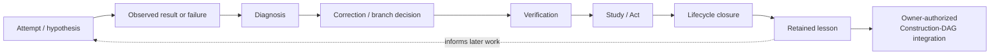
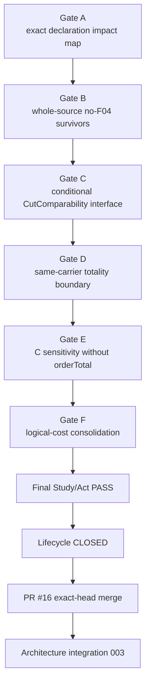

# LEARNING GRAPH VIEW — How BOMA Reached and Refined the Current Architecture

**View ID:** `BOMA-VIEW-LEARNING-GRAPH-001`  
**Status:** GENERATED / DERIVED VIEW / SYNCHRONIZED THROUGH ST2-EXP-004 INTEGRATION  
**Date:** 2026-08-25  
**Program:** `PDSA-ARCH-002` + Stage-Two controlled experiments + owner-authorized Learning-to-Construction Acts.

## Why this view exists

The Construction DAG answers:

```text
What is structurally true and retained now?
```

The Learning Graph answers:

```text
How did BOMA learn which distinctions, dependencies, alternatives,
convergence strengths, logical boundaries, genericity boundaries,
and checks belong in that structure?
```

A successful experiment may feed a verified lesson back into the permanent Construction DAG without disappearing from the Learning Graph.

Governing principles:

```text
SELECTS ≠ DERIVES
verified alternative ≠ accepted export
formal provenance ≠ mathematical necessity
successful experiment ≠ automatic promotion
```

## Generic BOMA learning cycle



Integration is governed. It does not automatically change `SELECTS`, accepted exports, or accepted implementation sources.

## Stage-One learning retained

### N-Core

```text
TCT calibration
→ N-DP-001 selects fresh inductive carrier
→ formalization exposes eliminator/universe under-specification
→ N-DP-002 makes scope explicit
→ V5 PASS
→ lesson: carrier/formal scope is an explicit commitment
```

### N-Arithmetic

```text
independent addR/addL → N-ADD-J-001 equality
independent mulR/mulL → N-MUL-J-001 equality
LEAdd/LEInd           → N-ORD-J-001 equivalence
→ lesson: canonical spelling after reconvergence does not erase producers
```

### Z and Q

The signed/difference-pair Z routes and raw-fraction Q construction retain their route, identity, reconvergence, and selection provenance. Reverse engineering after Z established interface reconvergence with provenance divergence rather than origin identity.

### R Stage One

```text
representation-neutral R target
→ R-DP-001 considers Dedekind/Cauchy
→ Dedekind selected for Stage One
→ R-DP-002 quotient identity selected
→ R-DP-003 localized classical comparability selected
→ multiplication/inverse choices exposed
→ RA-22 ACCEPT
→ RE-R-001 classifies selected commitments versus necessary interface
```

The Stage-One choices did not prove alternatives impossible. Later Stage-Two experiments tested those boundaries explicitly.

## Stage-Two Learning-to-Construction feedback

### ST2-EXP-001 — production dependency-boundary learning

Question:

```text
Does C really need the whole accepted R integration package?
```

Result:

```text
CLOSED / PASS / V5 32593045224
```

Learned fact:

```text
C's PRODUCTION mathematical R dependency is exactly the sixteen-property
surface; completeness/density/Archimedean and Dedekind internals in the old
closure are bundled formal provenance, not C mathematical necessity.
```

Construction-DAG feedback:

```text
REFINE BOMA-C-R-DEP-001
```

No Decision Point and no Junction were fabricated.

### ST2-EXP-002 — C representation robustness

Question:

```text
Can non-selected C-ROUTE-Q be completed independently rather than remaining only a probe/candidate?
```

Result:

```text
CLOSED / PASS
independent Route-Q field PASS
P/Q R-field isomorphism PASS
same accepted C Claim meanings preserved
```

Construction-DAG feedback:

```text
C-ROUTE-Q → PERMANENT VERIFIED ALTERNATIVE
ST2-EXP-002-PQ-J-001 → PERMANENT NON-ACCEPTANCE Junction
C-DP-001 still SELECTS C-ROUTE-P
```

### ST2-EXP-003 — R representation robustness

Question:

```text
Can Cauchy completion be built independently to full real strength, compared with Dedekind only after completion, and support downstream C mathematics?
```

Learned facts:

```text
Cauchy gives an independent complete ordered real field;
Dedekind and Cauchy reconverge through explicit field/order isomorphism;
seven selected C core meanings rebuild natively over Cauchy R;
selected Dedekind representation is not necessary for those meanings.
```

Construction-DAG feedback:

```text
R-ROUTE-C / Cauchy → PERMANENT VERIFIED ALTERNATIVE
ST2-EXP-003-R-J-001 → PERMANENT NON-ACCEPTANCE Junction
H6 → permanent downstream robustness evidence
R-DP-001 still SELECTS Dedekind
```

### ST2-EXP-011 — comparison dependency/genericity learning

Question:

```text
Does C-COMPARE-BLOCK-001 need to be scalar-hard-wired to the selected RBOMA implementation?
```

Gate-A closure learned the direct comparison interface:

```text
scalar operations
  zero / one / neg / add / mul

coordinate laws
  coord
  coordinateGeneration / coordinateUnique
  coordinateZero / coordinateOne / coordinateReal / coordinateImag
  coordinateNeg / coordinateAdd / coordinateMul
```

Learned facts:

```text
quadratic comparison direct scalar needs are smaller than C production needs;
accepted RBOMA Related semantics survive definitionally;
native RCBOMA/H6 can instantiate the interface without H5/Dedekind transport;
relation totality/uniqueness does not justify a global functional selector;
generic comparison roots add no axiom cost.
```

Construction-DAG feedback:

```text
REFINE C-COMPARE-BLOCK-001 dependency classification
KEEP BOMA-C-R-DEP-001 production surface unchanged
KEEP accepted C comparison source unchanged
KEEP C-J-001 / CA-20 unchanged
NO new Block / Decision Point / Junction
```

Final lifecycle-closed research head: `632a7134f26daf9dd781e3546804941f429a4246`; research merge: `72394878854aa69e865d17567959bec1daa70e6d`; architecture authority: `BOMA-ST2-LEARNING-INTEGRATION-002`.

### ST2-EXP-004 — R total-order logical-regime impact learning

Question:

```text
On the unchanged accepted Dedekind carrier/order/operations, what exactly depends
on the selected F-04 CutComparability/totality provider, and can same-carrier
disjunctive totality be recovered without it?
```

Single changed factor:

```text
remove only
  BOMA.R.DedekindOrderClassical001.cutComparability_classical
  BOMA.R.DedekindOrderClassical001.rLE_total_classical
```

Controls retained:

```text
LowerCut / CutEquiv / cutSetoid / RBOMA
CutLE / rLE and constructive refl/trans/antisymm
accepted R operation definitions
accepted Q/R/C manifests and mathematical sources
R-DP-001 / R-DP-002 / R-DP-004..006
F-05 / F-06 / F-07
C-DP-001 / C-J-001 / CA-20
ST2-EXP-001 production contract
ST2-EXP-011 comparison contract
```

Gate path:



Gate-A measured current declaration classes:

```text
F04_DIRECT             8
F04_TRANSITIVE         7
F04_FREE              22
OTHER_CLASSICAL_ONLY  18
unresolved             0
internal axioms        0
```

Gate B retained `77 / 88` accepted-manifest R source files in a research-only whole-source no-F04 assembly. Failure 004 during this work established an important tooling/scientific distinction: theorem declaration closure independence does not imply whole-source elaboration independence because a source file can contain helper declarations outside the target theorem closure.

Gate C showed that explicit `CutComparability` is a valid conditional interface. It did **not** supply an unconditional constructive comparability theorem.

Gate D established on the unchanged representation:

```text
RTotality ↔ CutComparability
```

No unconditional constructive `CutComparability` inhabitant was recovered from the frozen `LowerCut` fields.

Gate E removed exactly `orderTotal` from the ST2-EXP-001 sixteen-property C-production interface. Seven C Claim families survived:

```text
C-CL-CARRIER-001
C-CL-REMBED-001
C-CL-I-001
C-CL-GEN-001
C-CL-COORDUNIQ-001
C-CL-NONREAL-001
C-CL-COMPARE-001
```

The current `C-CL-FIELD-001` and `C-CL-INTEGRATION-001` proof closures did not survive; their measured dependence is transitive through the current square/nonnegative → norm → field path. This is proof-architecture sensitivity, not a mathematical-necessity theorem.

The comparison Claim survives and remains governed by the smaller ST2-EXP-011 scalar/coordinate boundary.

Logical lesson:

```text
NO F-04 dependency ≠ fully constructive R
F-05 / F-06 / F-07 remain independent controls
conditional CutComparability ≠ constructive recovery
formal declaration ancestry ≠ mathematical necessity
source packaging dependency ≠ theorem dependency
```

A located-cut redesign could be a separate future candidate but would change the representation and therefore was outside ST2-EXP-004.

Final research/lifecycle provenance:

```text
Frozen Plan commit     89c9dc9154e7ca469e5c94c177be223205ee9dbd
Final Study/Act commit 6779d028c49f73757ea838c163d3968a982559fe
exact closed head      1fe760de811ad2b176ead6f420b80ca1aab5ce46
research merge         61adb8589c803e95e1b96ef38902320c8aa5df19
merge content drift    zero files
```

Construction-DAG feedback:

```text
REFINE existing R-DP-003 knowledge
KEEP localized classical F-04 selection
RECORD RTotality ↔ CutComparability same-carrier boundary
RECORD exact F-04 current proof/package impact
RECORD independent F-05/F-06/F-07 controls
RECORD orderTotal downstream C sensitivity
KEEP accepted Q/R/C sources and manifests unchanged
NO new Block / Decision Point / Junction
```

Architecture authority: `BOMA-ST2-LEARNING-INTEGRATION-003`.

## CI-governance learning retained

Historical experiment closure is monotone evidence; current active/frontier state is time-varying program state. Postclosure ST2-EXP-004 Gate workflows are read-only historical sentinels and do not rerun the scientific experiment.

Failure `ST2-EXP-004_FAILURE_013` records the stale postclosure Gate-A ACTIVE-state assertion. It was a CI lifecycle defect, not a mathematical regression.

## What was not integrated as accepted structure

Successful experiments did **not** automatically promote:

```text
Cauchy R to R-BLOCK-001
Route Q to C-BLOCK-001/C-BLOCK-002
H6 C to accepted C
research/alternative Junctions to acceptance Junctions
ST2-EXP-011 experimental Lean sources to accepted comparison sources
ST2-EXP-004 no-F04 assemblies to accepted R
CutComparability hypothesis to a constructive theorem
located-cut redesign to the accepted carrier
any shared interface to a fabricated Junction
```

The integrations promote verified architectural knowledge, not accepted producer identity.

## Learning vs current-state classification

| Artifact/result | Construction-DAG role | Learning role |
|---|---|---|
| accepted Block / Claim certification | authoritative accepted interface | endpoint of learning paths |
| failed CI/V5 run | no current proof authority | diagnosis / prevention evidence |
| unverified candidate | none until authorized/verified | future question |
| verified non-selected route | may be permanent alternative architecture | demonstrates non-necessity / comparison evidence |
| non-acceptance Junction | may be permanent verified convergence fact | preserves exact reconvergence history |
| successful dependency experiment | may refine canonical dependency contract | records why the narrower contract is trusted |
| successful Decision-Point experiment | may refine knowledge attached to the existing decision | preserves exactly what the decision costs/controls |
| research implementation | not accepted unless separately promoted | exact witness for learned architecture fact |

## Current Learning Graph frontier

```text
ST2-EXP-001  CLOSED / PASS / lesson integrated
ST2-EXP-002  CLOSED / PASS / lesson integrated
ST2-EXP-003  CLOSED / PASS / lesson integrated
ST2-EXP-011  CLOSED / PASS / lesson integrated
ST2-EXP-004  CLOSED / PASS / lesson integrated
ACTIVE EXPERIMENT = NONE
AUTONOMOUS RESEARCH PROGRAM = NO_ACTIVE_PROGRAM
NEXT EXPERIMENT = NOT AUTHORIZED
REQUIRED NEXT ACT = STOP BEFORE NEW EXPERIMENT / OWNER AUTHORIZATION REQUIRED
```

No new experimental Learning-Graph branch is created by this sequence.

Architecture integration authorities:

```text
LAB/PDSA/STAGE_TWO_SUCCESSFUL_EXPERIMENTS_ARCHITECTURE_INTEGRATION_001.md
LAB/PDSA/STAGE_TWO_SUCCESSFUL_EXPERIMENTS_ARCHITECTURE_INTEGRATION_002.md
LAB/PDSA/STAGE_TWO_SUCCESSFUL_EXPERIMENTS_ARCHITECTURE_INTEGRATION_003.md
```