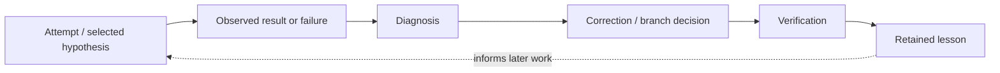
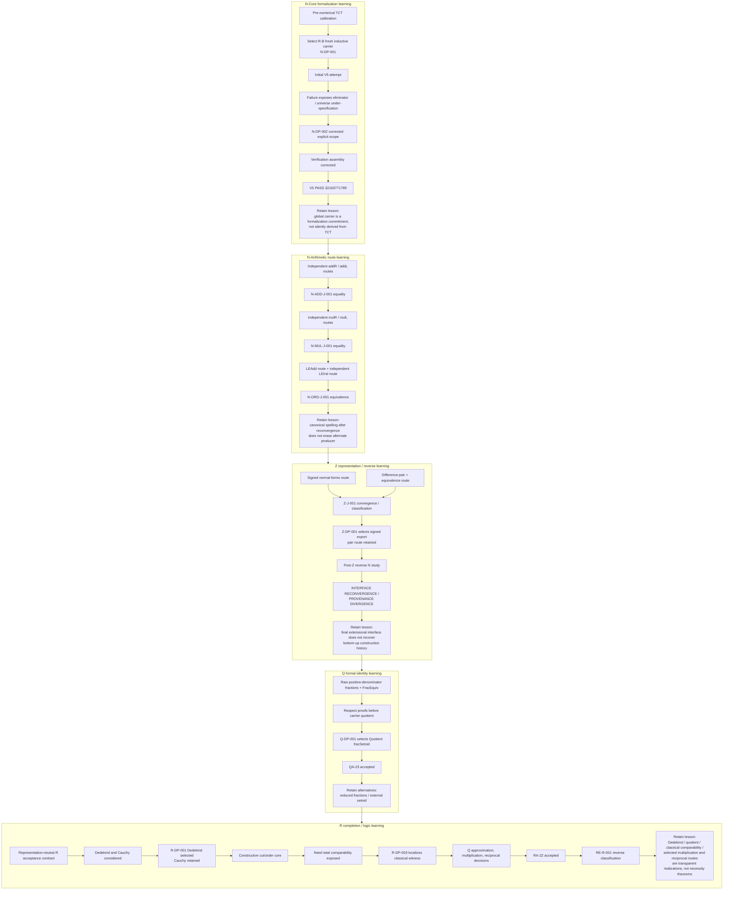
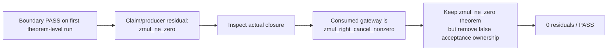
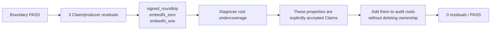
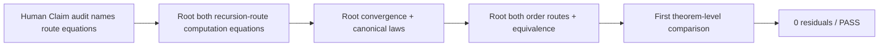
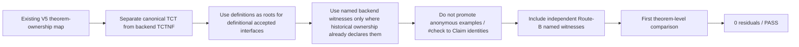

# LEARNING GRAPH VIEW — How BOMA Reached the Current Accepted Architecture

**View ID:** `BOMA-VIEW-LEARNING-GRAPH-001`  
**Status:** GENERATED / DERIVED VIEW  
**Date:** 2026-08-21  
**Program:** `PDSA-ARCH-002`

## Why this view exists

The current Construction DAG answers:

```text
What is accepted now?
```

The Learning Graph answers a different question:

```text
How did BOMA learn which current distinctions, commitments, routes, and checks were necessary?
```

A failed experiment or superseded route can therefore remain valuable even when it is not part of the current canonical export.

Governing principle:

> نصحح الحالة الحالية دون محو تاريخ التعلم الذي أدى إليها.

This view is derived from PDSA studies, failed/superseded evidence, Decision Points, reverse-engineering records, and the theorem-transparency calibration. It does **not** replace those records.

## Generic BOMA learning cycle



The loop is intentionally not represented as a one-way march toward an inevitable final architecture.

## Major learning paths retained in the current project



## Theorem-transparency learning program

### R calibration: hidden dependency discovery

```mermaid
flowchart LR
  R0[Declared R Claim closure complete]
  R1[Prototype execution defect:\naudit workspace outside package root]
  R2[Fix execution architecture]
  R3[5 semantic residuals]
  R4[Classify generated / metatheory provenance]
  R5[2 residuals]
  R6[Expose implicit proposition decision\nas localized Classical.em]
  R7[1 residual]
  R8[Remove proposition-extensionality proof artifact]
  R9[0 boundary residuals]
  R10[Add Claim↔producer ancestry comparator]
  R11[CLAIM_PRODUCER_PASS]

  R0 --> R1 --> R2 --> R3 --> R4 --> R5 --> R6 --> R7 --> R8 --> R9 --> R10 --> R11
```



Retained lesson:

```text
A source scan can look clean while theorem elaboration still consumes hidden logical/metatheoretic dependencies.
Actual formal closure must be measured, not inferred from stylistic inspection.
```

Historical records:

```text
LAB/PDSA/experiments/PDSA-ARCH-002-R-FORMAL-CLOSURE-PROTOTYPE-FAILURE-001.md
LAB/PDSA/experiments/PDSA-ARCH-002-R-FORMAL-CLOSURE-STUDY-001.md
```

### Q calibration: valid theorem ≠ acceptance producer



Retained lesson:

```text
A theorem may be correct, useful, and historically retained without being a producer of the accepted Claim closure.
Do not inflate acceptance ownership to make an audit pass.
```

Historical record:

```text
LAB/PDSA/experiments/PDSA-ARCH-002-Q-FORMAL-CLOSURE-STUDY-001.md
```

### Z calibration: explicit Claim ≠ necessarily downstream-consumed theorem



Retained lesson:

```text
The acceptance root surface is not identical to the set of theorems later consumers happen to reference.
An explicitly accepted property remains in the stage surface even when it is definitionally simple or downstream-unused.
```

Historical record:

```text
LAB/PDSA/experiments/PDSA-ARCH-002-Z-FORMAL-CLOSURE-STUDY-001.md
```

### N-Arithmetic: earlier lessons improve first-pass design



Retained lesson:

```text
A first-pass success can itself depend on accumulated learning from earlier failures.
Do not interpret it as evidence that route-sensitive transparency was trivial.
```

### N-Core: definitions, backend witnesses, and canonical ontology



Retained lesson:

```text
Formal verification syntax must not silently become canonical ontology.
A backend witness can certify a Claim without becoming the mathematical object the Claim is about.
```

## Operational learning: evidence-write race

```mermaid
flowchart LR
  E0[One Registry change triggers Q and R]
  E1[Both verify same branch SHA]
  E2[Stage A writes evidence commit]
  E3[Stage B exact-HEAD guard sees branch moved]
  E4[Otherwise-valid evidence rejected]
  E5[Diagnosis: evidence-promotion race, not math defect]
  E6[Shared concurrency group]
  E7[Guard verification-input drift only]
  E8[Q/R regression PASS]

  E0 --> E1 --> E2 --> E3 --> E4 --> E5 --> E6 --> E7 --> E8
```



Retained lesson:

```text
Evidence provenance must bind to the source actually verified while distinguishing verification-input drift from evidence-only branch movement.
```

This operational lesson now governs N-Core, N-Arithmetic, Z, Q, and R transparency workflows.

## Learning vs current-state classification

| Artifact/result | Current-state role | Learning role |
|---|---|---|
| accepted Block / Claim certification | authoritative current accepted interface | endpoint of one or more learning paths |
| failed V5 run | not current proof evidence | diagnosis of missing scope, assumption, or assembly condition |
| retained alternative route | not selected canonical export | demonstrates non-necessity / provides comparison or future branch |
| superseded proof implementation | not current source of truth | documents proof-engineering or logical-cost learning |
| reverse-engineering study | not forward construction member | classifies which information survives or is lost downstream |
| transparency residual | not acceptable final closure | exposes hidden dependency, over-ownership, or root undercoverage |

## Current Learning Graph frontier

The current learned state is:

```text
N-Core → R
mathematical acceptance preserved
+
independent machine transparency PASS for every accepted export
+
historical route/failure provenance retained
```

The Learning Graph does **not** continue into C because that stage has not been authorized.

```text
C NOT STARTED — USER HOLD
```
