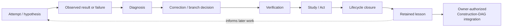
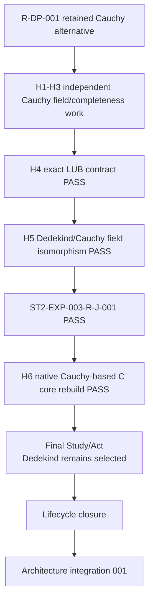
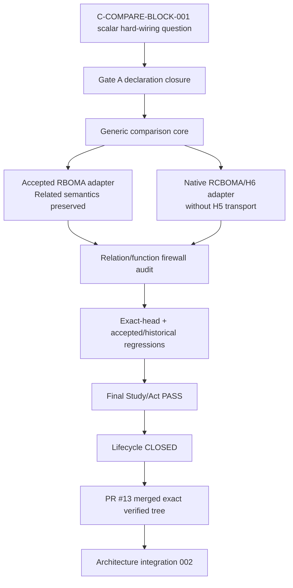

# LEARNING GRAPH VIEW — How BOMA Reached and Refined the Current Architecture

**View ID:** `BOMA-VIEW-LEARNING-GRAPH-001`  
**Status:** GENERATED / DERIVED VIEW / SYNCHRONIZED THROUGH ST2-EXP-011 INTEGRATION  
**Date:** 2026-08-24  
**Program:** `PDSA-ARCH-002` + Stage-Two controlled experiments + owner-authorized Learning-to-Construction Acts.

## Why this view exists

The Construction DAG answers:

```text
What is structurally true and retained now?
```

The Learning Graph answers:

```text
How did BOMA learn which distinctions, dependencies, alternatives,
convergence strengths, genericity boundaries, and checks belong in that structure?
```

A successful experiment may feed a verified lesson back into the permanent
Construction DAG without disappearing from the Learning Graph.

Governing principle:

> نصحح ونطوّر البنية الحالية دون محو تاريخ التعلم الذي أدى إليها.

## Generic BOMA learning cycle



Integration is governed. It does not automatically change `SELECTS`, accepted
exports, or accepted implementation sources.

## Stage-One learning retained

### N-Core

```text
TCT calibration
→ N-DP-001 selects fresh inductive carrier
→ formalization exposes eliminator/universe under-specification
→ N-DP-002 makes scope explicit
→ V5 PASS
→ lesson: carrier/formal scope is an explicit commitment
```

### N-Arithmetic

```text
independent addR/addL → N-ADD-J-001 equality
independent mulR/mulL → N-MUL-J-001 equality
LEAdd/LEInd           → N-ORD-J-001 equivalence
→ lesson: canonical spelling after reconvergence does not erase producers
```

### Z

```text
signed normal forms + difference-pair route
→ Z-J-001 representation convergence/classification
→ Z-DP-001 selects signed export
→ reverse-N study
→ Z-RE-J-001 INTERFACE RECONVERGENCE / PROVENANCE DIVERGENCE
```

### Q

```text
raw fractions + FracEquiv
→ operation-respect proofs
→ Q-DP-001 selects Quotient fracSetoid
→ QA-23 ACCEPT
→ alternative identity regimes retained
```

### R Stage One

```text
representation-neutral R target
→ R-DP-001 considers Dedekind/Cauchy
→ Dedekind selected for Stage One
→ logical/identity/multiplication/inverse choices exposed
→ RA-22 ACCEPT
→ RE-R-001 classifies selected commitments versus necessary interface
```

The Stage-One selection did not prove Cauchy impossible; that became a later
Stage-Two question.

## Stage-Two Learning-to-Construction feedback

### ST2-EXP-001 — production dependency-boundary learning

Question:

```text
Does C really need the whole accepted R integration package?
```

Experiment:

```text
BOMA-C-R-DEP-001
whole accepted R bundle
        ↓ controlled replacement
NarrowROrderedFieldCertificate
exact sixteen properties
        ↓
rebuild selected C adequacy
```

Result:

```text
CLOSED / PASS / V5 32593045224
```

Learned fact:

```text
C's PRODUCTION mathematical R dependency is exactly the sixteen-property
surface; completeness/density/Archimedean and Dedekind internals in the old
closure are bundled formal provenance, not C mathematical necessity.
```

Construction-DAG feedback:

```text
REFINE BOMA-C-R-DEP-001
```

No Decision Point and no Junction were fabricated.

### ST2-EXP-002 — C representation robustness

Question:

```text
Can non-selected C-ROUTE-Q be completed independently rather than remaining
only a probe/candidate?
```

Experiment:

```text
C-DP-001
   ├── frozen selected baseline C-ROUTE-P
   └── independently complete C-ROUTE-Q
             ↓
      compare only after independent field completion
             ↓
      ST2-EXP-002-PQ-J-001
```

Result:

```text
CLOSED / PASS
independent Route-Q field PASS
P/Q R-field isomorphism PASS
same accepted C Claim meanings preserved
```

Learned fact:

```text
C-ROUTE-P is selected but not mathematically unique as a realization of the
quadratic field meaning.
```

Construction-DAG feedback:

```text
C-ROUTE-Q → PERMANENT VERIFIED ALTERNATIVE
ST2-EXP-002-PQ-J-001 → PERMANENT NON-ACCEPTANCE Junction
C-DP-001 still SELECTS C-ROUTE-P
```

### ST2-EXP-003 — R representation robustness

Question:

```text
Can Cauchy completion be built independently to full real strength, compared
with Dedekind only after completion, and support downstream C mathematics?
```

Experiment learning path:



Learned facts:

```text
Cauchy gives an independent complete ordered real field;
Dedekind and Cauchy reconverge through explicit field/order isomorphism;
seven selected C core meanings rebuild natively over Cauchy R;
selected Dedekind representation is not necessary for those meanings.
```

Construction-DAG feedback:

```text
R-ROUTE-C / Cauchy → PERMANENT VERIFIED ALTERNATIVE
ST2-EXP-003-R-J-001 → PERMANENT NON-ACCEPTANCE Junction
H6 → permanent downstream robustness evidence
R-DP-001 still SELECTS Dedekind
```

### ST2-EXP-011 — comparison dependency/genericity learning

Question:

```text
Does C-COMPARE-BLOCK-001 mathematically need to be scalar-hard-wired to the
selected RBOMA/RStageIntegrationCertificate realization, or can the comparison
meaning be factored through a smaller generic scalar/coordinate interface?
```

Controlled change:

```text
only the scalar abstraction of the quadratic comparison machinery
```

Controls retained:

```text
accepted R-BLOCK-001 and R-DP-001 selection
accepted C-DP-001 / C-ROUTE-P / C-BLOCK-001
accepted C-J-001 / C-BLOCK-002 / CA-20
accepted comparison meaning
relation-level comparison != functional comparison
ST2-EXP-003 RCBOMA/H5/H6 provenance
```

Gate-A closure learned the direct comparison interface:

```text
scalar operations
  zero / one / neg / add / mul

coordinate laws
  coord
  coordinateGeneration / coordinateUnique
  coordinateZero / coordinateOne / coordinateReal / coordinateImag
  coordinateNeg / coordinateAdd / coordinateMul
```

This is strictly a **comparison** boundary. It does not replace the sixteen-field
**production** boundary from ST2-EXP-001.

Verification path:



Final lifecycle-closed verification:

```text
head      632a7134f26daf9dd781e3546804941f429a4246
run       32754345656
artifact  9530261359
sha256    d93c6f1ec34858f6cbc1556e92b86a241f6399e6a3cf894204608a51d63de2e5
result    SUCCESS
```

Research/lifecycle merge:

```text
72394878854aa69e865d17567959bec1daa70e6d
```

Learned facts:

```text
quadratic comparison direct scalar needs = zero/one/neg/add/mul + coordinate laws;
accepted RBOMA Related semantics survive definitionally;
native RCBOMA/H6 can instantiate the same interface without H5/Dedekind transport;
relation totality/uniqueness does not justify a global functional selector;
generic comparison root adds no axiom cost.
```

Construction-DAG feedback:

```text
REFINE C-COMPARE-BLOCK-001 dependency classification
KEEP BOMA-C-R-DEP-001 production surface unchanged
KEEP accepted C comparison source unchanged
KEEP C-J-001 / CA-20 unchanged
NO new Block / Decision Point / Junction
```

This is integration of **knowledge**, not automatic adoption of the experimental
Lean implementation as the accepted comparison source.

## CI-governance learning during ST2-EXP-011 closure

The post-Study lifecycle transition exposed a distinct governance lesson:

```text
historical experiment closure = monotone evidence
current active/frontier state  = time-varying program state
```

Historical workflows for 001–003 were corrected to verify preservation of their
closed state without requiring the global Stage-Two frontier to remain empty
forever. The failures remain preserved as provenance.

This governance correction did not change any closed mathematical result.

## What was not integrated as accepted structure

Successful experiments did **not** automatically promote:

```text
Cauchy R to R-BLOCK-001
Route Q to C-BLOCK-001/C-BLOCK-002
H6 C to accepted C
research/alternative Junctions to acceptance Junctions
ST2-EXP-011 experimental Lean sources to accepted comparison sources
ST2-EXP-011 shared generic interface to a fabricated Junction
```

The integration promoted verified architectural knowledge, not accepted producer
identity.

## Theorem-transparency lessons still retained

Past transparency calibration remains part of the Learning Graph:

```text
actual formal closure must be measured, not inferred from source cleanliness;
valid theorem ≠ accepted Claim producer;
accepted Claim roots ≠ only downstream-consumed theorems;
formal verification syntax must not silently become canonical ontology;
evidence-write races are operational failures, not mathematical failures;
historical lifecycle facts must not be conflated with current frontier state.
```

## Learning vs current-state classification

| Artifact/result | Construction-DAG role | Learning role |
|---|---|---|
| accepted Block / Claim certification | authoritative accepted interface | endpoint of learning paths |
| failed V5 run | no current proof authority | diagnosis / prevention evidence |
| unverified candidate | none until authorized/verified | future question |
| verified non-selected route | may be permanent alternative architecture | demonstrates non-necessity / comparison evidence |
| non-acceptance Junction | may be permanent verified convergence fact | preserves exact reconvergence history |
| successful dependency experiment | may refine canonical dependency contract | records why the narrower contract is trusted |
| successful Block-interface experiment | may refine the Block's dependency classification | preserves how genericity was established |
| research implementation | not accepted unless separately promoted | exact witness for learned architecture fact |
| reverse-engineering study | classification input | shows which information survives downstream |

## Current Learning Graph frontier

```text
ST2-EXP-001  CLOSED / PASS / lesson integrated
ST2-EXP-002  CLOSED / PASS / lesson integrated
ST2-EXP-003  CLOSED / PASS / lesson integrated
ST2-EXP-011  CLOSED / PASS / lesson integrated
ACTIVE EXPERIMENT = NONE
NEXT OWNER-SEQUENCED EXPERIMENT = ST2-EXP-004 / NOT ACTIVE / NO FROZEN PLAN
```

The next experimental Learning Graph branch is not created until the integration
Act is merged, `main` is synchronized/re-read, and a new ST2-EXP-004 Plan is
explicitly frozen from that exact `main`.

Architecture integration authorities:

```text
LAB/PDSA/STAGE_TWO_SUCCESSFUL_EXPERIMENTS_ARCHITECTURE_INTEGRATION_001.md
LAB/PDSA/STAGE_TWO_SUCCESSFUL_EXPERIMENTS_ARCHITECTURE_INTEGRATION_002.md
```
