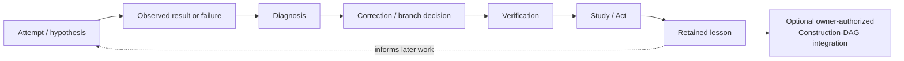
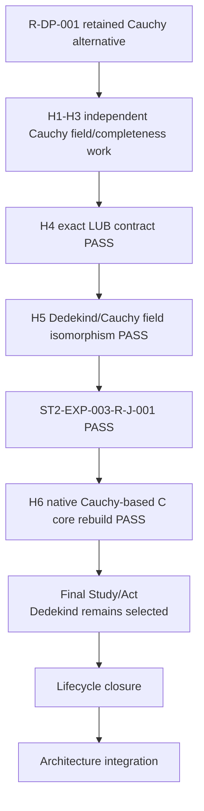

# LEARNING GRAPH VIEW — How BOMA Reached and Refined the Current Architecture

**View ID:** `BOMA-VIEW-LEARNING-GRAPH-001`  
**Status:** GENERATED / DERIVED VIEW / SYNCHRONIZED THROUGH STAGE TWO  
**Date:** 2026-08-24  
**Program:** `PDSA-ARCH-002` + Stage-Two controlled experiments.

## Why this view exists

The Construction DAG answers:

```text
What is structurally true and retained now?
```

The Learning Graph answers:

```text
How did BOMA learn which distinctions, dependencies, alternatives,
convergence strengths, and checks belong in that structure?
```

A successful experiment can now feed a verified lesson back into the permanent
Construction DAG without disappearing from the Learning Graph.

Governing principle:

> نصحح ونطوّر البنية الحالية دون محو تاريخ التعلم الذي أدى إليها.

## Generic BOMA learning cycle



Integration is optional and governed. It does not automatically change `SELECTS`
or accepted exports.

## Stage-One learning retained

### N-Core

```text
TCT calibration
→ N-DP-001 selects fresh inductive carrier
→ first formalization exposes eliminator/universe under-specification
→ N-DP-002 makes scope explicit
→ V5 PASS
→ lesson: global carrier/formal scope is an explicit commitment
```

### N-Arithmetic

```text
independent addR/addL → N-ADD-J-001 equality
independent mulR/mulL → N-MUL-J-001 equality
LEAdd/LEInd           → N-ORD-J-001 equivalence
→ lesson: canonical spelling after reconvergence does not erase producers
```

### Z

```text
signed normal forms + difference-pair route
→ Z-J-001 representation convergence/classification
→ Z-DP-001 selects signed export
→ reverse-N study
→ Z-RE-J-001 INTERFACE RECONVERGENCE / PROVENANCE DIVERGENCE
```

### Q

```text
raw fractions + FracEquiv
→ operation-respect proofs
→ Q-DP-001 selects Quotient fracSetoid
→ QA-23 ACCEPT
→ alternative identity regimes retained
```

### R Stage One

```text
representation-neutral R target
→ R-DP-001 considers Dedekind/Cauchy
→ Dedekind selected for Stage One
→ logical/identity/multiplication/inverse choices exposed
→ RA-22 ACCEPT
→ RE-R-001 classifies selected commitments versus necessary interface
```

The Stage-One selection did not prove Cauchy impossible; that became a later
Stage-Two question.

## Stage-Two Learning-to-Construction feedback

### ST2-EXP-001 — dependency boundary learning

Question:

```text
Does C really need the whole accepted R integration package?
```

Experiment:

```text
BOMA-C-R-DEP-001
whole accepted R bundle
        ↓ controlled replacement
NarrowROrderedFieldCertificate
exact sixteen properties
        ↓
rebuild selected C adequacy
```

Result:

```text
CLOSED / PASS / V5 32593045224
```

Learned fact:

```text
C's mathematical R dependency is exactly the sixteen-property surface;
completeness/density/Archimedean and Dedekind internals in the old closure are
bundled formal provenance, not C mathematical necessity.
```

Construction-DAG feedback:

```text
REFINE BOMA-C-R-DEP-001
```

No Decision Point and no Junction were fabricated.

### ST2-EXP-002 — C representation robustness

Question:

```text
Can the non-selected C-ROUTE-Q be completed independently rather than remaining
only a probe/candidate?
```

Experiment:

```text
C-DP-001
   ├── frozen selected baseline C-ROUTE-P
   └── independently complete C-ROUTE-Q
             ↓
      compare only after independent field completion
             ↓
      ST2-EXP-002-PQ-J-001
```

Result:

```text
CLOSED / PASS
independent Route-Q field PASS
P/Q R-field isomorphism PASS
same accepted C Claim meanings preserved
```

Learned fact:

```text
C-ROUTE-P is selected but not mathematically unique as a realization of the
quadratic field meaning.
```

Construction-DAG feedback:

```text
C-ROUTE-Q becomes a PERMANENT VERIFIED ALTERNATIVE branch
ST2-EXP-002-PQ-J-001 becomes a PERMANENT NON-ACCEPTANCE Junction
C-DP-001 still SELECTS C-ROUTE-P
```

### ST2-EXP-003 — R representation robustness

Question:

```text
Can Cauchy completion be built independently to full real strength, compared
with Dedekind only after completion, and support downstream C mathematics?
```

Experiment learning path:



Learned facts:

```text
Cauchy gives an independent complete ordered real field;
Dedekind and Cauchy reconverge through explicit field/order isomorphism;
seven selected C core meanings rebuild natively over Cauchy R;
selected Dedekind representation is not necessary for those meanings.
```

Construction-DAG feedback:

```text
R-ROUTE-C / Cauchy becomes a PERMANENT VERIFIED ALTERNATIVE branch
ST2-EXP-003-R-J-001 becomes a PERMANENT NON-ACCEPTANCE Junction
H6 becomes permanent downstream robustness evidence
R-DP-001 still SELECTS Dedekind
```

## What was not integrated as accepted structure

Successful experiments did **not** automatically promote:

```text
Cauchy R to R-BLOCK-001
Route Q to C-BLOCK-001/C-BLOCK-002
H6 C to accepted C
research/alternative Junctions to acceptance Junctions
ST2-EXP-011 to an active experiment
```

The owner-authorized integration promoted **verified architectural knowledge**,
not accepted producer identity.

## Theorem-transparency lessons still retained

Past transparency calibration remains part of the Learning Graph:

```text
actual formal closure must be measured, not inferred from source cleanliness;
valid theorem ≠ accepted Claim producer;
accepted Claim roots ≠ only downstream-consumed theorems;
formal verification syntax must not silently become canonical ontology;
evidence-write races are operational failures, not mathematical failures.
```

These lessons remain documented in their original PDSA failure/study records.

## Learning vs current-state classification

| Artifact/result | Construction-DAG role | Learning role |
|---|---|---|
| accepted Block / Claim certification | authoritative accepted interface | endpoint of learning paths |
| failed V5 run | no current proof authority | diagnosis / prevention evidence |
| unverified candidate | none until authorized/verified | future question |
| verified non-selected route | may be permanent alternative architecture | demonstrates non-necessity / comparison evidence |
| non-acceptance Junction | may be permanent verified convergence fact | preserves exact reconvergence history |
| successful dependency experiment | may refine canonical dependency contract | records why the narrower contract is trusted |
| reverse-engineering study | classification input | shows which information survives downstream |

## Current Learning Graph frontier

```text
ST2-EXP-001  CLOSED / PASS / lesson integrated
ST2-EXP-002  CLOSED / PASS / lesson integrated
ST2-EXP-003  CLOSED / PASS / lesson integrated
NO ACTIVE EXPERIMENT
NEXT EXPERIMENT SLOT OPEN / OWNER SELECTION REQUIRED
```

The next Learning Graph branch is not created until an experiment candidate is
explicitly selected and frozen.

Architecture integration authority:

`LAB/PDSA/STAGE_TWO_SUCCESSFUL_EXPERIMENTS_ARCHITECTURE_INTEGRATION_001.md`.
