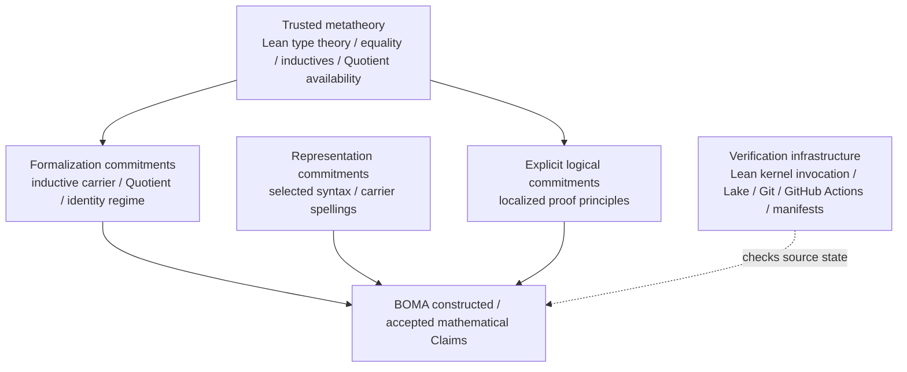
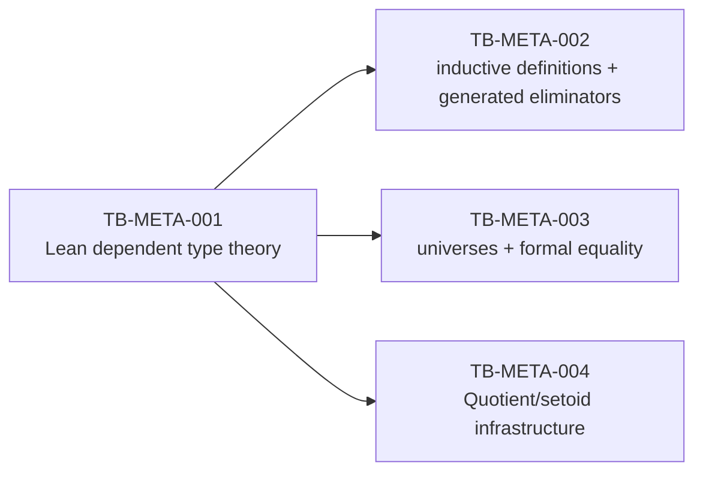
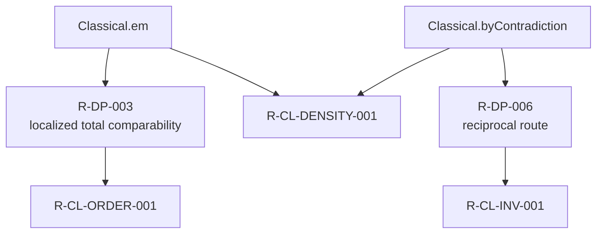
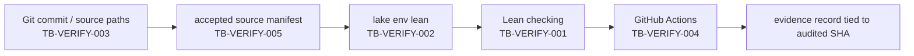

# LOGIC AND TRUST VIEW — Constructed Mathematics vs Commitments vs Trusted Base

**View ID:** `BOMA-VIEW-LOGIC-TRUST-001`  
**Status:** GENERATED / DERIVED VIEW  
**Date:** 2026-08-21  
**Program:** `PDSA-ARCH-002`

## Governing distinction

```text
BOMA-constructed mathematics
  ≠ representation/formalization choices
  ≠ explicit logical commitments
  ≠ trusted metatheory
  ≠ verification infrastructure
```

The purpose of this view is not to minimize trust by terminology. It is to prevent a host-level resource or a selected formalization route from masquerading as an object-level mathematical theorem.

Primary sources:

```text
LAB/00_ARCHITECTURE/TRUSTED_BASE.md
LAB/00_ARCHITECTURE/FORMAL_DEPENDENCY_POLICY.json
LAB/00_ARCHITECTURE/DECISION_LEDGER.md
LAB/00_ARCHITECTURE/CLAIM_REGISTRY.md
stage formal-dependency classification evidence
```

## Layered trust architecture



Arrows express dependency/verification roles, not derivation of mathematics from infrastructure alone.

## Stage commitment map

| Stage | Constructed/accepted mathematical layer | Representation / formalization commitments | Explicit logical commitments reached by certified closure |
|---|---|---|---|
| N-Core | unary carrier interface, induction/generatedness, recursion/initiality, TCT bridge, converged no-confusion, standardness | fresh R-B global inductive `BOMANat`; selected eliminator/universe scope; backend `TCTNF` only as verification representation | none stage-specific in certified external boundary |
| N-Arithmetic | addition, multiplication, order, route convergence, monotonicity | canonical spellings selected after convergence: `add := addR`, `mul := mulR`, `LE := LEAdd` | none stage-specific |
| Z | representation convergence, ring, embedding/generation, ordered-ring interface | signed normal forms selected after convergence; difference-pair route retained; no quotient carrier required | none stage-specific |
| Q | rational field/order/embedding/generation interface | positive-denominator raw fractions; `QBOMA := Quotient fracSetoid` selected; quotient identity not necessary by theorem | none stage-specific |
| R | ordered-field-strength real interface, Dedekind LUB completeness, Q density, Archimedean property | Dedekind lower cuts selected; `RBOMA := Quotient cutSetoid`; selected multiplication/inverse architectures | `Classical.em`, `Classical.byContradiction` at localized declared proof sites |

## Certified external-boundary summary

| Stage | External leaves | Trusted metatheory | Trusted formalization infrastructure | Declared logical commitment | Residual |
|---|---:|---:|---:|---:|---:|
| N-Core | 40 | 40 | 0 | 0 | 0 |
| N-Arithmetic | 40 | 40 | 0 | 0 | 0 |
| Z | 60 | 60 | 0 | 0 | 0 |
| Q | 72 | 63 | 9 | 0 | 0 |
| R | 76 | 65 | 9 | 2 | 0 |

These numbers describe the **audited acceptance-root closures**, not every declaration that exists anywhere in the repository.

## Trusted metatheory entries



### Important non-collapse

```text
Lean supports inductives
  ≠ N-DP-001 was mathematically forced

Lean supports Quotient
  ≠ QBOMA or RBOMA had to use Quotient identity

Lean supports classical reasoning
  ≠ accepted BOMA Claims may use it silently
```

The availability of a facility belongs to trust/formalization infrastructure. Its actual selection or consumption remains a BOMA commitment that must be declared where relevant.

## Explicit logical commitment path in R



This is a **localized logical-cost view**, not a claim that these principles are necessary for all constructions of the reals. Cauchy and constructive-strengthened-cut alternatives remain outside the selected Stage-One route.

## Formal identity choices

| Carrier | Accepted identity regime | Classification |
|---|---|---|
| N-Core | Lean formal equality on fresh inductive `BOMANat` | formalization commitment tied to R-B regime |
| Z | Lean formal equality on selected signed normal forms | representation/formalization selection after route convergence |
| Q | equality in `Quotient fracSetoid` | formalization commitment / methodological choice |
| R | equality in `Quotient cutSetoid` | formalization commitment / methodological choice |

Retained external equivalence relations remain semantically important:

```text
ZPair relation      ZEquiv
raw rational        FracEquiv
raw Dedekind cuts   CutEquiv
```

Formal equality after quotient/selection does not erase these historical or representation-level identity regimes.

## Verification infrastructure



A green workflow is not used as a free-standing truth predicate. BOMA records:

```text
audited target/root set
accepted assembly
pinned toolchain
verified source SHA
classification result
Claim/producer result
residual count
```

## Evidence-promotion integrity

Stage transparency workflows use one shared evidence-write concurrency group and reject stale evidence if verification inputs changed after a run started.

Movement limited to evidence/status/non-input documentation may be tolerated only while evidence remains explicitly tied to the source SHA actually audited.

This distinction was learned from a real cross-stage evidence-write race and is part of the program's operational provenance model.

## Current non-claims

The transparency program does not prove:

```text
Lean kernel implementation correctness from first principles
hardware / OS / GitHub service correctness
mathematical necessity of selected carriers or identity regimes
absence of all possible alternative logical regimes
C construction
```

## Current boundary

```text
C NOT STARTED — USER HOLD
```
